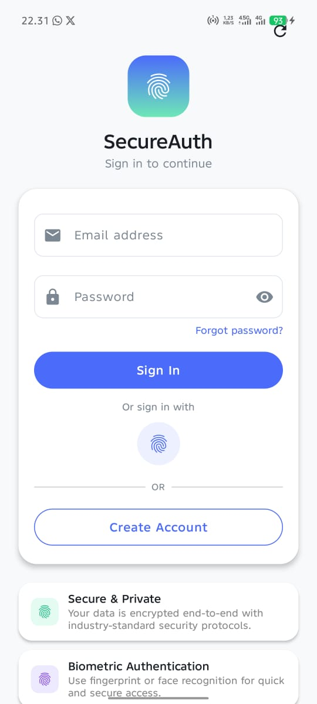
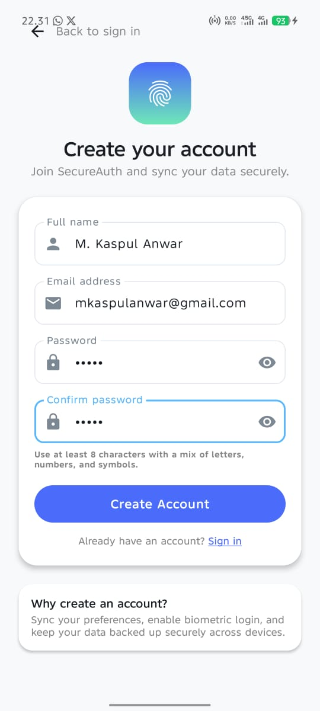
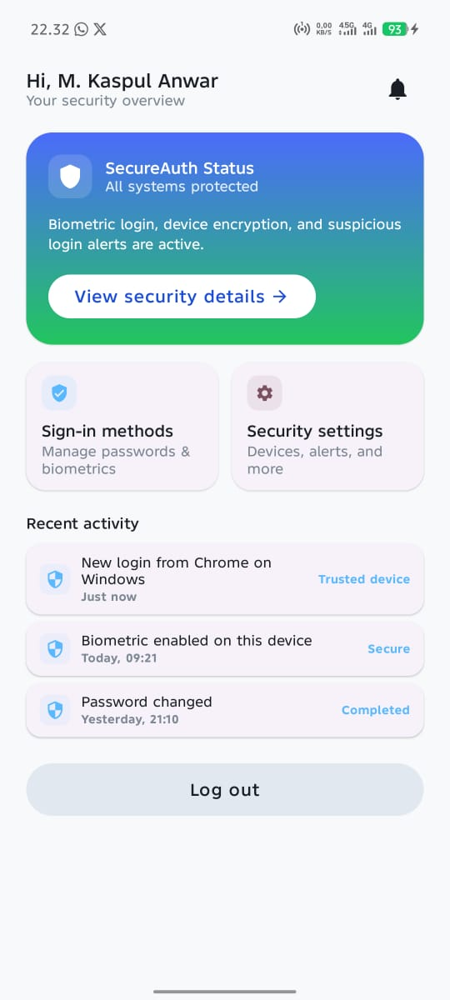
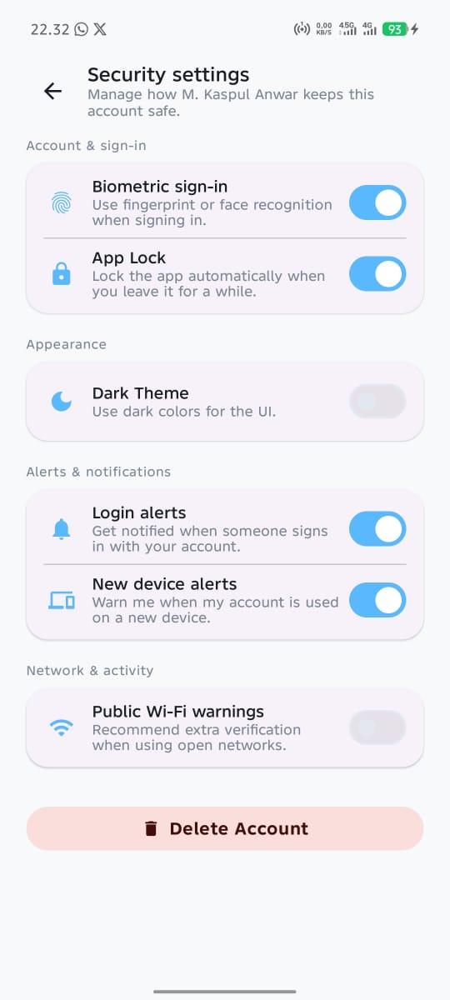
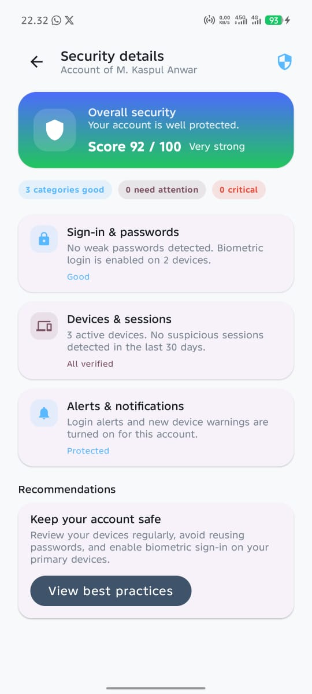
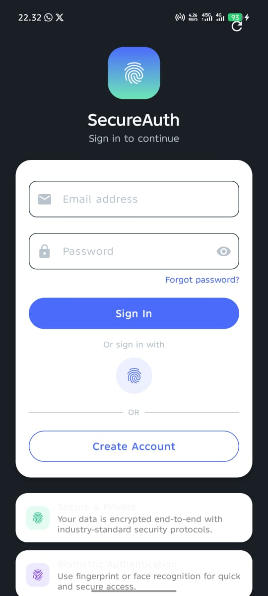
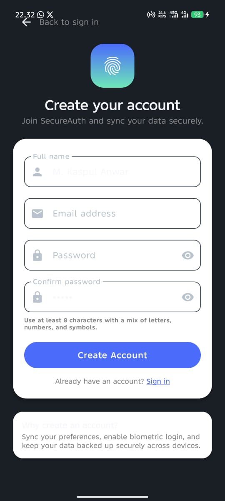
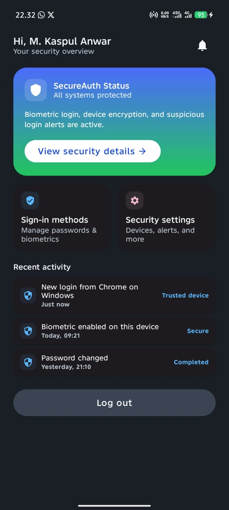
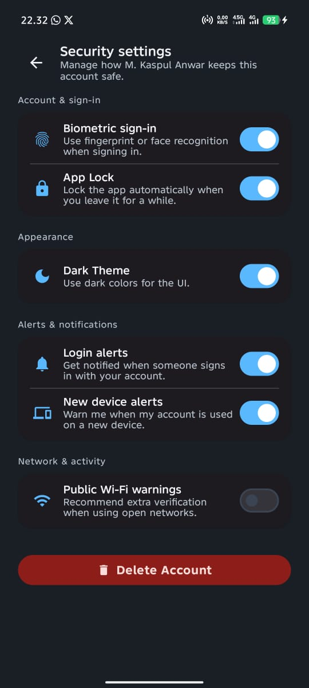
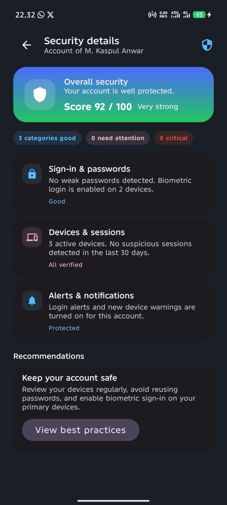

# PRAKTIKUM #7+ : MENERAPKAN DESAIN UI MODERN (P7ModernUi + SecureAuth)

<p align="center">
  
  
  
  
  
</p>

Repositori ini berisi implementasi praktikum Mobile Programming Modul #7 yang berfokus pada penerapan **Desain UI Modern** pada aplikasi Android menggunakan **Jetpack Compose** dan **Material Design 3 (MD3)**, termasuk fitur keamanan **Biometric Authentication (App Lock)**.

---

## Tim Developer

| Peran | Nama | NIM | Profil GitHub |
| :--- | :--- | :--- | :--- |
| **Pengembang Proyek** | M. Kaspul Anwar | 230104040212 | [](https://github.com/mkaspulanwar) |
| **Dosen Pengampu** | Muhayat, M. IT | - | [](https://github.com/muhayat-lab) |

---

## Fitur Utama & Hasil Praktikum

Proyek ini berhasil mengimplementasikan beberapa konsep inti Desain UI Modern:

* **Material Design 3 (MD3):** Penerapan sistem desain terbaru Android untuk antarmuka yang intuitif dan adaptif.
* **Dynamic Color:** Aplikasi mampu menyesuaikan skema warna (Primary, Secondary, Tertiary, dll.) secara otomatis berdasarkan *wallpaper* pengguna (pada Android 12+).
* **Dark Mode/Light Mode:** Implementasi tema gelap dan terang yang diatur melalui *Settings Screen* atau preferensi sistem.
* **App Lock (Biometric Auth):** Menambahkan lapisan keamanan menggunakan **Biometric Authentication** (Fingerprint/Face Unlock) untuk melindungi akses ke aplikasi.
* **Komponen MD3:** Penggunaan komponen modern seperti `Button`, `Card`, `TextField`, dan `TopAppBar` dari pustaka Material 3 di Jetpack Compose.

---

## Tujuan Praktikum

Berikut adalah poin-poin tujuan yang telah dicapai dalam praktikum ini:

1.  Menjelaskan dan menerapkan **prinsip desain UI modern** sesuai **Material Design 3**.
2.  Mengimplementasikan **Color Scheme, Typography, dan Shape** pada aplikasi Android.
3.  Membuat file *theme* dan *style* yang **modular, *reusable***, dan **konsisten**.
4.  Menerapkan **komponen Material 3** (`Button`, `Card`, `TextField`, `AppBar`).
5.  Menggunakan **Dynamic Color** & **Custom Color Palette**.
6.  Menerapkan **Dark Mode** dan **Light Mode** secara benar.
7.  Melakukan **UI refinement** agar aplikasi tampil profesional.

---

## Struktur Direktori Proyek
Proyek ini menggunakan struktur paket yang terorganisir, memisahkan logika utama (aplikasi entry point dan lifecycle) dari arsitektur UI (screens, components, theme, dan viewmodels).

```bash
id.antasari.p7_modern_ui_230104040212
├── ui                                  # Folder Utama: Struktur Tampilan dan Logika UI (ViewModel)
│   ├── screens                         # Layar Utama Aplikasi (Pages/Destinations Composable)
│   │   ├── LoginScreen.kt
│   │   ├── CreateAccountScreen.kt
│   │   ├── HomeScreen.kt
│   │   ├── SecurityDetailsScreen.kt
│   │   └── SettingsScreen.kt           # Layar untuk mengatur Theme dan Biometric Auth
│   ├── auth
│   │   └── AuthViewModel.kt            # Logic pusat (State Management untuk Auth, App Lock, Theme)
│   ├── components                      # Komponen UI yang Dapat Digunakan Ulang (Reusable Components)
│   │   ├── AppButton.kt
│   │   ├── AppCard.kt
│   │   ├── AppTextField.kt
│   │   └── ...                         # (Komponen MD3 custom lainnya)
│   ├── navigation
│   │   └── AppNavHost.kt               # Definisi Rute Navigasi (Navigation Graph)
│   └── theme                           # Implementasi Material Design 3 (Design System)
│       ├── Color.kt                    # Palet Warna, Dynamic Color Scheme, & Custom Color
│       ├── Shape.kt                    # Bentuk Sudut Komponen
│       ├── Type.kt                     # Konfigurasi Tipografi
│       └── Theme.kt                    # Konfigurasi Tema Global (P7ModernUiTheme)
├── MainActivity.kt                     # [1] Entry point & App Lifecycle (Mengelola App Lock)
├── SecureAuthApp.kt                    # [2] Root Composable & Global Dependencies
├── AccountStorage.kt                   # [3] Handler untuk Local Data Persistence (Shared Preferences)
├── BiometricUtils.kt                   # [4] Helper untuk cek ketersediaan sensor Biometrik
├── LoginScreen.kt                      # [5] Screen: Halaman Otentikasi/Masuk
├── CreateAccountScreen.kt              # [6] Screen: Halaman Pendaftaran Akun
├── HomeScreen.kt                       # [7] Screen: Halaman Utama Aplikasi
├── SecurityDetailsScreen.kt            # [8] Screen: Detail Keamanan
├── SettingsScreen.kt                   # [9] Screen: Pengaturan Tema (Dark/Light Mode) & Biometrik

```

---

## Konsep Dasar yang Diimplementasikan

Praktikum ini berlandaskan pada konsep-konsep inti dalam pengembangan UI/UX modern Android:

### 1. Material Design 3 (MD3)
Pembaruan dari Material Design yang membawa estetika baru dengan penekanan pada:
* **Dynamic Color:** Skema warna adaptif.
* **Smooth Corner Shape:** Penggunaan sudut membulat yang lebih halus.
* **Motion & Elevation:** Animasi dan kedalaman yang ditingkatkan.
* **Accessibility:** Kontras dan skala yang lebih baik.

### 2. Theme
*Theme* adalah fondasi visual aplikasi yang mengatur tampilan global dari semua komponen UI.
* **ColorScheme:** Set warna aplikasi (Primary, Secondary, Background, dll.).
* **Typography:** Setelan untuk teks (Font Family, Weight, Size).
* **Shape:** Bentuk dan sudut untuk berbagai komponen.

### 3. Style (di Jetpack Compose)
Dalam Compose, *style* diwujudkan dalam bentuk:
* **Modifier Reusable:** Rantai `Modifier` yang dapat digunakan ulang di banyak komponen.
* **Component Styling:** Pengaturan parameter spesifik pada komponen (misalnya `ButtonDefaults`, `TextStyle`).

### 4. Design System
*Design System* memastikan konsistensi visual di seluruh aplikasi dengan menyediakan *satu sumber kebenaran* untuk:
* Warna dan Komponen
* Layout dan Spacing
* Icon

---

## Tools & Teknologi

* **Bahasa Pemrograman:** Kotlin
* **Framework UI:** Jetpack Compose
* **Design System:** Material Design 3 (MD3)
* **IDE:** Android Studio
* **Fitur Keamanan:** Biometric Library

---

## Screenshoot Desain Aplikasi

Aplikasi ini sepenuhnya mengadopsi Material Design 3 (MD3), menggunakan Dynamic Color, dan mendukung dua mode tema utama: Light Mode dan Dark Mode.

### Light Mode Preview

| Layar 1: Login | Layar 2: Buat Akun | Layar 3: Beranda (Home) |
| :---: | :---: | :---: |
|  |  |  |
| *Menampilkan komponen MD3 seperti Outlined TextField dan Primary Button.* | *Menunjukkan formulir pendaftaran dengan Tipografi MD3.* | *Menampilkan Card dan TopAppBar serta Dynamic Color Scheme.* |
| **Layar 4: Pengaturan (Settings)** | **Layar 5: Detail Keamanan** | |
|  |  | |
| *Toggles untuk Dark Mode, Dynamic Color, dan App Lock Biometric.* | *Detail pengaturan Biometric Authentication.* | |

### Dark Mode Preview

| Layar 1: Login | Layar 2: Buat Akun | Layar 3: Beranda (Home) |
| :---: | :---: | :---: |
|  |  |  |
| *Aplikasi beralih ke skema warna gelap dengan kontras yang optimal.* | *Penerapan Dark Mode pada formulir dan latar belakang.* | *Menguji Dynamic Color pada latar belakang gelap dan komponen.* |
| **Layar 4: Pengaturan (Settings)** | **Layar 5: Detail Keamanan** | |
|  |  | |
| *Toggles mempertahankan state di tema gelap.* | *Memperlihatkan status App Lock Biometric yang aktif di tema gelap.* | |

---
